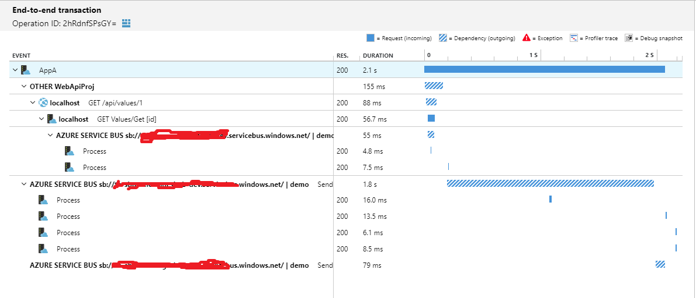
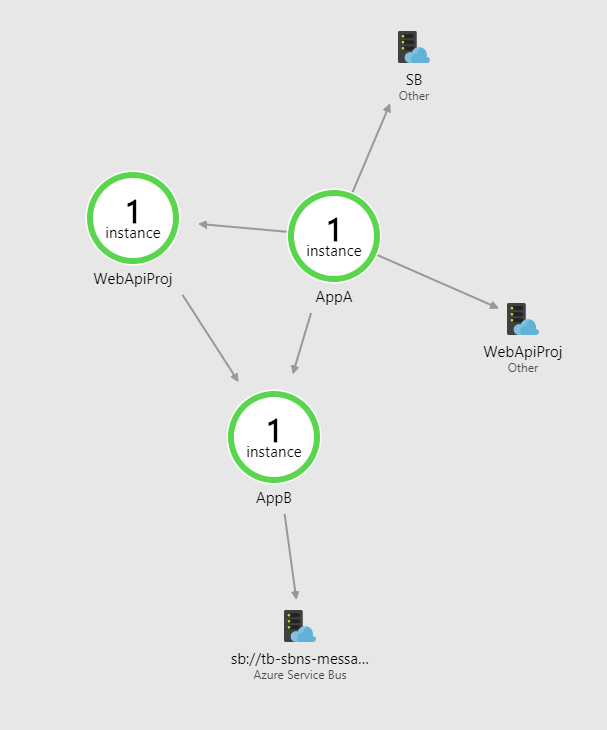
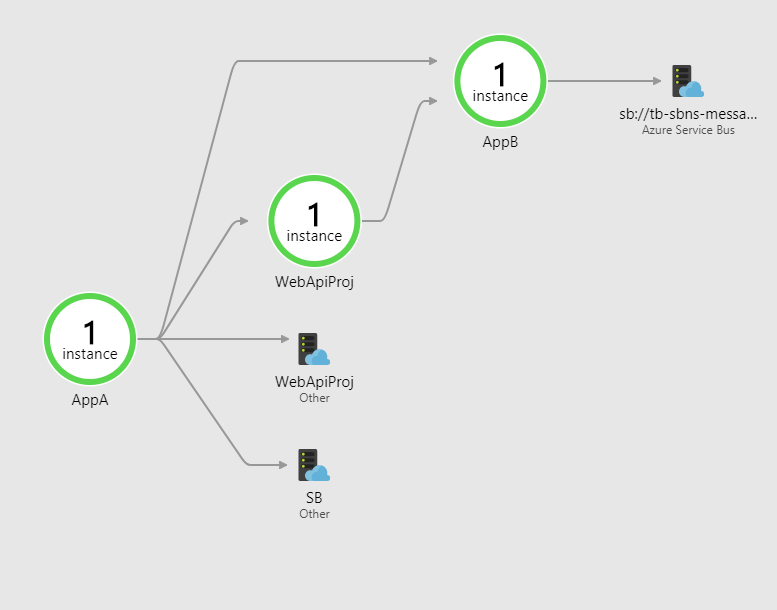

# Application Insights + WebApi + Service Bus sample

This prject demostrates how to track requests across 3 microservice, passing operation ID's acreoss HTTP boundary 
and across Service Bus.

## Waht you will get

### Ability to view End-to-end tranactions

### Ability to view applications map

## How to run?

1. Provision services in azure
    1. Create aplication isight application in Azure
    1. Create Service Bus in Azure
    1. Create Topick "demo"
    1. Create Subscription under topick called "sub1"
2. Configure sources
    1. Copy file CommonLib/Constants.cs.template to name CommonLib/Constants.cs
    1. Fill in AI instrumetation key
    1. Fill in Azure SB connection string
    
    

